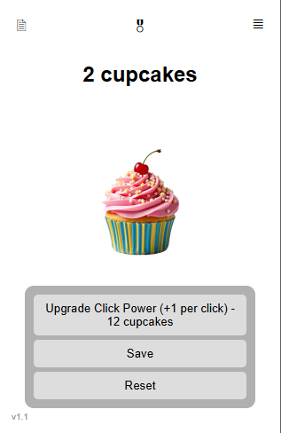
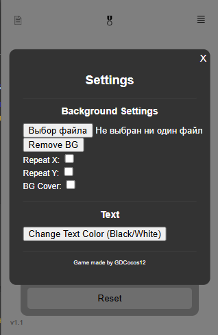
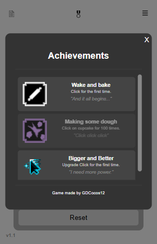

# Cupcake Clicker Extension

A Cupcake Clicker game implemented as a Chrome Extension. Click the cupcake, earn cupcakes, upgrade your click power, and maybe even unlock some achievements!

## Screenshots

## Features

*   **Click to Earn:** Click the cupcake to increase your cupcake count.
*   **Upgrade Click Power:** Buy upgrades to increase the number of cupcakes you earn per click.
*   **Save/Reset Game:** Save your progress or start over.
*   **Settings Panel:** Customize the appearance with background images and text color.
*   **Achievements:** Unlock achievements for reaching certain milestones.

## Installation

#### Release download

1. Go to Releases and download .crx file.
2. Open it with your browser.
3. Enjoy!

#### Hard Way

1.  Download the repository as a ZIP file.
2.  Extract the ZIP file to a directory of your choice.
3.  Open Chrome and navigate to `chrome://extensions`.
4.  Enable "Developer mode" in the top right corner.
5.  Click "Load unpacked" and select the directory where you extracted the ZIP file.
6.  The Cupcake Clicker Extension icon should now appear in your Chrome toolbar.

## Usage

1.  Click the Cupcake Clicker Extension icon in your Chrome toolbar.
2.  The game popup will appear.
3.  Click the cupcake to earn cupcakes.
4.  Use the "Upgrade Click Power" button to increase the number of cupcakes you earn per click.
5.  Use the "Save" button to save your progress.
6.  Use the "Reset" button to reset your game.
7.  Click the settings button (☰) to open the settings panel and customize the appearance.
8.  Click the changelog button (🗎) to view the update history.
9.  Click the achievements button (🎖) to view and track your progress.

## Controls

*   **Left Mouse Button:** Click the... everything. (Who would've thought, huh?)

## Achievements

The game features a set of achievements to add a bit more depth to gameplay. Unlock them by reaching specific milestones. See the achievements panel for a full list and their requirements.

## Credits

Game made by GDCocos12.

## License

This project is licensed under the [MIT License](LICENSE).
